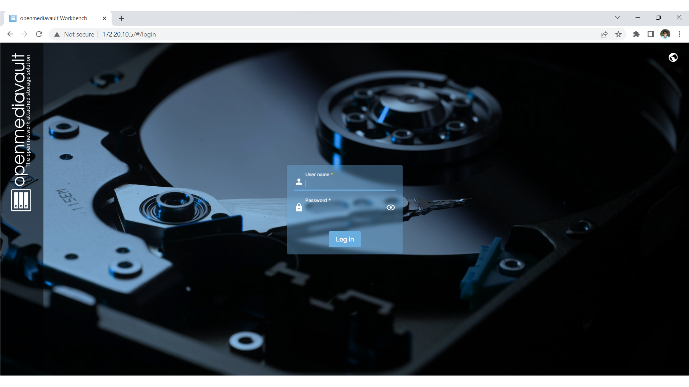

<!-- # ECE4180-Pi-NAS

A network attached storage (NAS) system built from a Raspberry Pi to save and load files for anywhere on the network -->

# Pi NAS - ECE 4180 Final Project

#### Developed by: Nicholas Schantz & Mohit Pinninti


  

<!--   -->

  

## Description

A network attached storage (NAS) system built from a Raspberry Pi to save and load files for anywhere on the network

  

- Parts List:

- MBed Cortex M3

- uLCD for MBed & wires

- Breadboard

- MicroUSB to USB Cable

- Raspberry Pi

- 3D Printer

- Monitor & HDMI Adapter

- Hard Drive or SSD (a USB drive will suffice to start)

- SATA to USB connector

- microSD card

  
  

## Install Raspbian OS Lite using Raspberry Pi Imager

In this section we will set up the Raspberry Pi with Raspbian OS Lite - a simple terminal to install our NAS software with.

  

Necessary Components / Software

- Raspberry Pi 3 or 4

- Micro SD Card

- Computer with a microSD slot (or an SD card slot and a microSD to SD converter)

  

1. Download and install the Raspberry Pi Imager tool from the official Raspberry Pi website: [https://www.raspberrypi.org/software/](https://www.raspberrypi.org/software/)

2. Insert the SD card into your computer's SD card reader and open Raspberry Pi Imager. Install "Raspbian Lite (32-bit)" and write it to the SD card. 

3. Insert the SD card into your Raspberry Pi, connect it to a monitor and keyboard and follow the on-screen prompts to complete the setup process.


## Setup OpenMediaVault
OpenMediaVault is a linux distribution designed to run a NAS. It provides a GUI for setup and can be installed from the command line

1. First update the Pi by running the following commands (make sure you are connected to a network first. This can be done with ```sudo raspi-config```):
```shell-session
sudo apt-get update
sudo apt-get upgrade -y
```

2. Note: if you are using a Raspberry Pi 3 - run the following command to revert to the classic interface names for the network card. This is important because OpenMediaVault uses this convention.
```shell-session
sudo rm -f /etc/systemd/network/99-default.link
```


3. To get OpenMediaVault, run the following command. The Pi will restart after the installation is complete.
```shell-session
sudo wget -O - https://github.com/OpenMediaVault-Plugin-Developers/installScript/raw/master/install | sudo bash
```

4. Log in and check if you are still connected to the internet (use ```ifconfig``` and look for an ip address). Otherwise you will need to connect to the internet using ```sudo omv-firstaid```. Select "Configure network interface", and then the network interface. We used wifi aka "wlan0". Select "Yes" to configuring IPv4 and using DHCPv4, but "No" to configuring IPv6 and WOL. Enter the SSID and the password for your network and wait for the pi to connect. You can test this by running ```ping 8.8.8.8``` and looking for replies, or by running ```ifconfig``` and seeing an IPv4 address next to wlan0 (or your preferred network interface. After connecting insert your storage drive into the Pi.

5. Run ```ifconfig``` and navigate to the IP address shown for wlan0 (or your preferred network interface) on a different network-connected device. You should see a screen similar to the following:



6. Log in with the default credentials (you may want to change this password):
		Username: admin
		Password: openmediavault
	Navigate to "Storage" on the left hand side and click "Disks". Click refresh and look for the disk that matches the one that you previously inserted into the Pi. Once it is found, navigate to "File Systems", once again under "Storage" and create a new file system using the plus symbol at the top of the menu. Choose EXT4 since with are on Linux on the Pi, select the disk that you previously inserted, and save and mount the file system. Apply the changes using the apply button that appears at the top-right of the screen.

7. Navigate to "Shared Folders" under "Storage" and click the plus symbol to create a new shared folder. Give it a name, select your previously created file system and give it a relative folder path that you like to identify it using. Keep the default permissions and press save to save the shared folder. Click on the folder in the menu to get to the permissions, allow "All" to read/write and save. Click on the checklist in the same menu to get to the access control, allow "All" to read/write and save. Finally, apply the changes using the apply button at the top-right of the screen.

8. Lastly, for use with a Windows PC, navigate to "SMB/CIFS" on the right side under "Services", click on Settings and make sure the Enabled checkbox is checked at the top. Then, go back and click on Shares. Click on the plus symbol to create a new share, make sure the Share is Enabled also, select the shared folder that you previously created, set public to "Guests Only", make sure Browseable box is checked, and click save to save the share.

9. OpenMediaVault should now be set up! On your computer, make sure network discovery is on for your network, then open your File Explorer. Navigate and right-click on This PC and click on Map Network Drive. Click Browse, search for the Raspberry Pi, and open the associated folder that you set up under the Raspberry Pi and click finish to save the mapping. You should now be able to easily transfer data between your Pi NAS and your PC.

## Setup MBed & uLCD with Metrics
The mbed microcontroller will be used to communicate with a uLCD to display metrics regarding the usage of the disk, the Raspberry Pi CPU, RAM, and other errors. 

1. Connect the uLCD to the mbed using the following pin-out:


Clone this repo. Navigate to [Keil Studio](https://studio.keil.arm.com/auth/login/) on your PC, create an account if you do not have one, and import the "mbed_src" folder from this repo as a new project. Compile this project and drag the ".bin" file into your mbed file system after connecting the mbed LPC1768 to your PC. The project is now loaded onto the mbed. This will receive formatted data from the Raspberry Pi to display on the uLCD.

2. To send the data to the mbed & uLCD, the Raspberry Pi must first fetch all the data and format it. To do this, run ```sudo apt-get install git``` on the Raspberry Pi to install git. After git is installed, run ```git clone https://github.com/mohitpinninti/ECE4180-Pi-NAS.git``` to clone the repo so that the files from "pi_src" can be used.

3. Perform the following (which are also specified in the README.md in the "pi_src" folder):
	1. Install bc using ```sudo apt install bc```
	2. Add the full paths of the specified files to the top of the "get_stats_verbose.c" file and compile it
	3. Add a crontask. This can be done by opening the cron scheduler using ```crontab -e``` and appending ```@reboot "PATH TO COMPILIED 'get_stats_verbose.c'"``` to the end of the file.
Compile the get_stats_verbose.c file using ```gcc get_stats_verbose.c```

4. Finally, connect the Pi to the mbed and restart the Pi using ```sudo reboot```. This is it! The Pi should automatically send data to the mbed as well as automatically connect to the network and be able to share data using SMB. 

5. Optional Packaging: The mbed, Pi and LCD can be fitted into a 3D printed case, for which we have included the model in the github.


  

## Demo Video
[]({https://drive.google.com/file/d/1eY3ktBOjqsRpZMn5wWA6uxW0Deq4UkJh/view?usp=share_link} "Video Link")